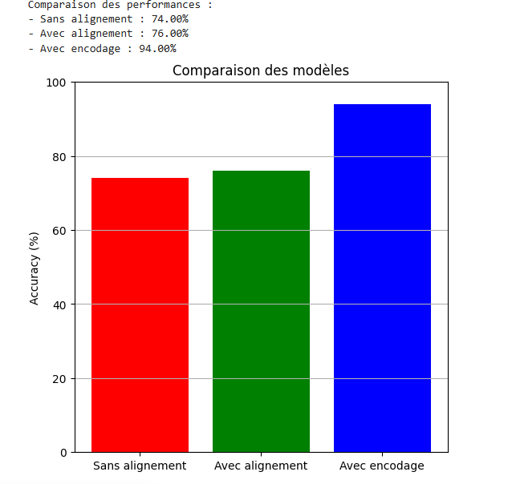
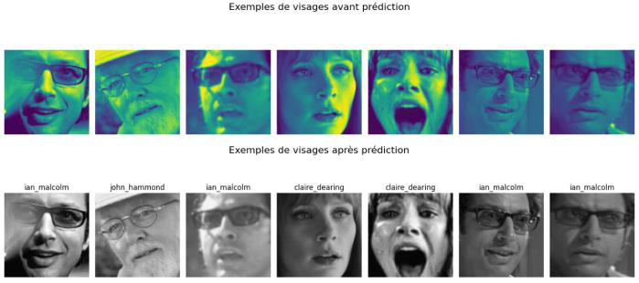

<div align="center">

#  Face Recognition with Deep Learning

**Detect · Align · Encode · Recognize** — a complete face recognition pipeline built with Python, OpenCV and dlib.


[Report (PDF)](report/IEEE_Report_Deep_Learning.pdf) · [Notebook](notebooks/TP7_Oscar_Brault.ipynb) · [Results](#-results)

</div>

---

##  About

This project was carried out at **ESIEE Paris** (AI & Deep Learning course, 2025). The goal is to build a face recognition system that works on **images and videos**, balancing **accuracy** and **speed**, while staying lightweight enough to run on limited computing resources.

Instead of training a large convolutional network directly on pixels, each face is turned into a compact **128‑dimensional vector** by a pre‑trained ResNet encoder. Recognizing a person then boils down to a simple classification (or distance computation) on these vectors — fast to train, fast to run, and easy to extend to new people **without retraining a deep network**.

A full write‑up in IEEE format is available in [`report/`](report/IEEE_Report_Deep_Learning.pdf).

##  Pipeline


| Step | What it does | Tool |
|------|--------------|------|
| **1. Detection** | Locates faces and crops them (128×128, 3 channels) | dlib HOG / CNN detectors |
| **2. Pose estimation** | Finds 68 facial landmarks and warps the face to a reference template (`MINMAX_TEMPLATE`) | dlib shape predictor (Kazemi & Sullivan) |
| **3. Encoding** | Converts each face into a 128‑D vector, trained with a *triplet loss* (FaceNet‑style) | dlib ResNet face encoder |
| **4. Recognition** | Predicts the identity from the vector | scikit‑learn classifiers |

##  Results

### From raw pixels to encodings

A small CNN trained directly on cropped faces reaches **74 %** accuracy on the test set (70/30 split). Aligning the faces first gives **76 %**, and switching to 128‑D encodings jumps to **94 %**.

<p align="center">
  
</p>

| Approach | Test accuracy |
|----------|:-------------:|
| CNN, no alignment | 74 % |
| CNN, with landmark alignment | 76 % |
| **Face encoding + classifier** | **94 %** |

### Classifier comparison (on encodings)

| Classifier | Accuracy | Training time | Prediction time |
|------------|:--------:|:-------------:|:---------------:|
| Logistic Regression | 92 % | 0.03 s | 0.00 s |
| **SVM** | **100 %** | **0.01 s** | 0.00 s |
| k‑NN | 100 % | 0.00 s | 0.05 s |
| Neural Network (MLP) | 100 % | 0.40 s | 0.00 s |

> SVM offers the best trade‑off between accuracy and speed. k‑NN is just as accurate but gets slower at prediction time as the database grows.

<p align="center">
  
</p>

### Custom dataset

We built our own dataset from short videos of **9 people** (~100 frames extracted per video, one folder per person). The SVM reaches **100 % accuracy** on it, and can be extended simply by adding a new folder for a new person.

>  For privacy reasons, the dataset and the images of real people are **not** included in this repository.

### Bias analysis (extra)

The report discusses how unbalanced data leads to unfair performance across demographic groups, and which metrics to monitor per group (accuracy, FPR, FNR, precision, recall, F1‑score). See section *F. Extra – Bias analysis* of the [report](report/IEEE_Report_Deep_Learning.pdf).

##  Repository structure

```
.
├── notebooks/
│   └── TP7_Oscar_Brault.ipynb      # Full pipeline: detection → alignment → encoding → recognition
├── report/
│   └── IEEE_Report_Deep_Learning.pdf
├── assets/                          # Figures used in this README
├── models/                          # dlib model files (not versioned, see below)
├── requirements.txt
└── README.md
```

##  Getting started

### 1. Clone and install

```bash
git clone https://github.com/<your-username>/<your-repo>.git
cd <your-repo>

python -m venv .venv
source .venv/bin/activate        # Windows: .venv\Scripts\activate
pip install -r requirements.txt
```

>  `dlib` needs CMake and a C++ compiler to build. With Anaconda you can also run `conda install -c conda-forge dlib`.

### 2. Download the dlib models

Place these files in the `models/` folder:

- `shape_predictor_68_face_landmarks.dat`
- `shape_predictor_5_face_landmarks.dat`
- `dlib_face_recognition_resnet_model_v1.dat`
- `mmod_human_face_detector.dat` (only for the CNN detector)

They are available from the [dlib model repository](http://dlib.net/files/) (decompress the `.bz2` archives). The course archive `models.zip` also contains them.

### 3. Prepare your data

Organize your images **one folder per person**:

```
data/
├── alice/
│   ├── 0001.jpg
│   └── ...
└── bob/
    ├── 0001.jpg
    └── ...
```

You can extract frames from a video with the helper function included in the notebook (`extract_frames`).

### 4. Run the notebook

```bash
jupyter notebook notebooks/TP7_Oscar_Brault.ipynb
```

>  The notebook was developed on **Kaggle**: paths such as `/kaggle/input/...` must be adapted to your local folders.

### 5. Recognize faces in a video or webcam

```python
process_movie("path/to/video.mp4", outvideo_name="result.mp4")   # video file
process_movie(0)                                                  # webcam
```

##  Tech stack

`Python` · `OpenCV` · `dlib` · `Keras / TensorFlow` · `scikit-learn` · `NumPy` · `Matplotlib`

##  Possible improvements

- Compare more detectors/encoders (e.g. modern PyTorch‑based models)
- Quantitative per‑group fairness evaluation on a larger, more diverse dataset
- Open‑set recognition (rejecting unknown faces with a distance threshold)
- Real‑time optimization for webcam streams

##  References

1. J. Sebastian, *Reconocimiento facial mediante el uso de PCA y algoritmo de reconocimiento Viola‑Jones*, 2018.
2. F. Schroff, D. Kalenichenko, J. Philbin, [*FaceNet: A unified embedding for face recognition and clustering*](https://doi.org/10.1109/cvpr.2015.7298682), CVPR 2015.
3. S. Zafeiriou, C. Zhang, Z. Zhang, [*A survey on face detection in the wild*](https://doi.org/10.1016/j.cviu.2015.03.015), CVIU 2015.
4. V. Kazemi, J. Sullivan, [*One millisecond face alignment with an ensemble of regression trees*](https://doi.org/10.1109/cvpr.2014.241), CVPR 2014.
5. O. M. Parkhi, A. Vedaldi, A. Zisserman, *Deep Face Recognition*, 2015.

##  Authors

- **Oscar Brault** — [GitHub](https://github.com/<your-username>) · [LinkedIn](https://www.linkedin.com/in/<your-profile>)
- **Victor Chen** — [GitHub](https://github.com/<victor-username>)

ESIEE Paris — AI & Deep Learning, 2025.

##  Acknowledgements

This assignment is based on Adam Geitgey's article [*Machine Learning is Fun! Part 4: Modern Face Recognition with Deep Learning*](https://medium.com/@ageitgey/machine-learning-is-fun-part-4-modern-face-recognition-with-deep-learning-c3cffc121d78). Course material provided by ESIEE Paris.

## 📄 License

Distributed under the MIT License. See [`LICENSE`](LICENSE) for details.
